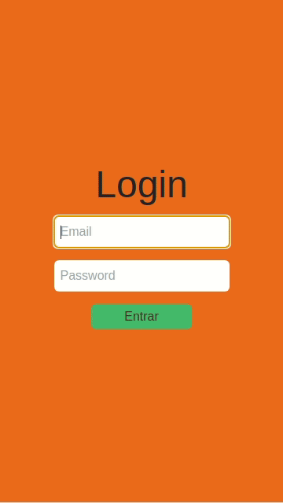
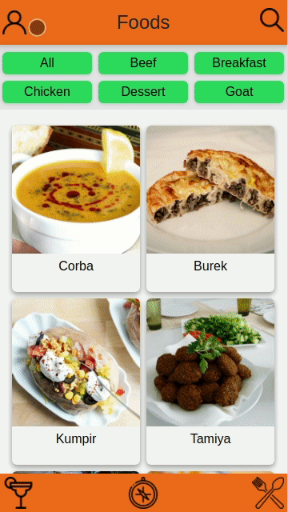
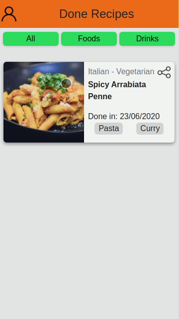
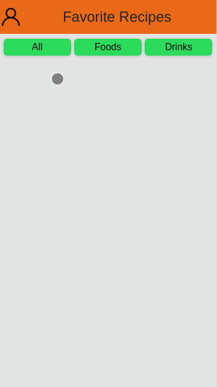
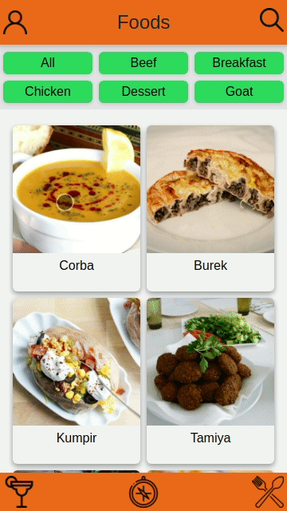

# App de Receitas


> O grupo desenvolveu os arquivos que estão em `src/`, `gifs/`, `README.md` e imagem `Aplicacao.png` 

* Todos arquivos exeto os citados acima foram desenvolvidos pela [Trybe](https://www.betrybe.com/).

## Contexto

Este projeto trata-se de um app de receitas.Nele é possível ver, buscar, favoritar e acompanhar o progresso de receitas e drinks.

Colegas que contribuiram com o projeto:
@GabrielzinJacques
@TalisonSantana
@mmdec

* APIs Utilizadas:

  [TheMealDB API](https://www.themealdb.com/api.php)
  </br>O TheMealDB é um banco de dados aberto, mantido pela comunidade, com receitas e ingredientes de todo o mundo.

  [The CockTailDB API](https://www.thecocktaildb.com/api.php)
  </br>Bem similar (inclusive mantida pela mesma entidade) a TheMealDB API, só que focado em bebidas.
  O Layout tem o foco dipositivos móveis

## Técnologias usadas

Front-end:
> Desenvolvido usando: Kanban, React, React Hooks, React Context API, Tailwind

## Layout

O Layout do projeto é focado em dispositivos móveis

* Tela de login </br>
  

* Tela principal botões de categorias </br>
  

* Tela principal botão de pesquisa (lupa) </br>
  

* Tela de receitas favoritas </br>
  

* Tela de explorar ingredientes </br>
 

* Tela de iniciar a receita </br>
  

## Instalando Dependências

* clone o repositorio

  ```bash
    git clone git@github.com:Andreyrvs/recipes-app.git
  ```

* instale as dependências:

  ```bash
    npm install
  ```

## Executando aplicação

* Para rodar o front-end:

  ```bash
    npm start
  ```

## Executando Testes

* Para rodar os testes de linter:

  ```bash
    npm run lint
  ```
