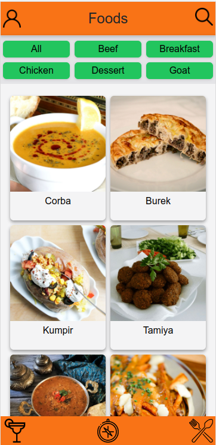

# App de Receitas



## Contexto

Este projeto trata-se de um app de receitas.Nele é possível ver, buscar, favoritar e acompanhar o progresso de receitas e drinks.

O Layout tem o foco dipositivos móveis

@GabrielzinJacques
@TalisonSantana
@mmdec

## Técnologias usadas

Front-end:
> Desenvolvido usando: React, React Hooks, React Context API, Tailwind

## Instalando Dependências

* clone o repositorio

  ```bash
    git clone git@github.com:Andreyrvs/recipes-app.git
  ```

* instale as dependências:

  ```bash
    npm install
  ```

## Executando aplicação

* Para rodar o front-end:

  ```bash
    npm start
  ```

## Executando Testes

* Para rodar os testes de linter:

  ```bash
    npm run lint
  ```
